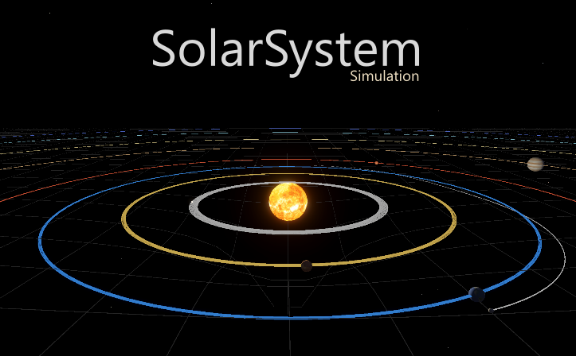

# 🌌 Solar System Simulation

A realistic 3D solar system simulation built with Unity, featuring Newtonian gravity physics, spacetime curvature visualization, and accurate planetary mechanics.



## ✨ Features

### Physics Simulation
- **Newtonian Gravity**: Realistic gravitational interactions using Newton's law of universal gravitation
- **Velocity Verlet Integration**: Stable numerical integration for accurate orbital mechanics
- **Sub-stepping**: Maintains stability even at high time scales
- **Orbital Mechanics**: Planets follow realistic elliptical orbits around the Sun

### Celestial Bodies
- ☀️ **Sun** - Central star with realistic lighting and emission
- 🪨 **Mercury** - Smallest planet, closest to the Sun
- 🟠 **Venus** - Retrograde rotation (spins backwards)
- 🌍 **Earth** - With orbiting Moon
- 🔴 **Mars** - The red planet
- 🟤 **Jupiter** - Gas giant with fast rotation
- 🪐 **Saturn** - Complete with ring system
- 🔵 **Uranus** - Extreme axial tilt (97.8°)
- 🔵 **Neptune** - Distant ice giant
- 🌙 **Moon** - Earth's natural satellite with proper orbital mechanics

### Visual Features
- **Realistic Textures**: High-quality planet textures
- **Spacetime Curvature Grid**: Visualize how mass warps spacetime
- **Orbital Trails**: See the path each planet takes
- **Axial Tilt**: Each planet rotates on its realistic axis
- **Day/Night Cycle**: Proper illumination from the Sun
- **Star Field**: 2000+ background stars

### Camera System
- **Follow Camera**: Lock onto any celestial body
- **Free Camera**: Explore the solar system freely
- **Smooth Zoom**: Logarithmic zoom for seamless navigation

### Time Control
- **Variable Time Scale**: From 0.1x to 50x speed
- **Pause Function**: Freeze time to observe
- **Stable Physics**: Maintains accuracy at all speeds

## 🎮 Controls

### Camera
| Key | Action |
|-----|--------|
| `TAB` | Toggle Free/Follow camera |
| `F` | Cycle through planets (Follow mode) |
| `Right Click + Drag` | Rotate camera |
| `Scroll Wheel` | Zoom (Follow) / Speed (Free) |

### Free Camera Movement
| Key | Action |
|-----|--------|
| `W A S D` | Move horizontally |
| `E` | Move up |
| `Q` | Move down |
| `Shift` | Move faster |

### Time
| Key | Action |
|-----|--------|
| `↑` | Increase time speed |
| `↓` | Decrease time speed |
| `Space` | Pause/Resume |

### View
| Key | Action |
|-----|--------|
| `G` | Toggle spacetime curvature grid |
| `H` | Toggle controls UI |

## 🔧 Requirements

- **Unity**: 6000.3.8f1 LTS or newer
- **Render Pipeline**: Universal Render Pipeline (URP)
- **Input System**: New Input System package

## 📦 Installation

1. Clone the repository:
   ```bash
   git clone https://github.com/yourusername/solar-system-simulator.git

2. Open the project in Unity Hub

3. If prompted, install required packages:
  - Universal RP
  - Input System
  - TextMeshPro

4. Open the main scene:
    ```bash
    Assets/Scenes/SolarSystem.unity

5. Press Play!

## 📁 Project Structure
  ```bash
    Assets/
    ├── Materials/           # Planet materials
    ├── Resources/
    │   ├── Textures/       # Planet textures
    │   └── Materials/      # Runtime-loaded materials
    ├── Scenes/
    │   └── SolarSystem.unity
    ├── Scripts/
    │   ├── CelestialBody.cs       # Planet/moon component
    │   ├── GravityManager.cs      # Physics simulation
    │   ├── CameraController.cs    # Camera system
    │   ├── SolarSystemSetup.cs    # System generator
    │   ├── PlanetRotation.cs      # Axial rotation
    │   ├── SunLight.cs            # Sun lighting
    │   ├── SaturnRings.cs         # Saturn's rings
    │   ├── StarField.cs           # Background stars
    │   ├── SpacetimeCurvature.cs  # Gravity visualization
    │   ├── TimeController.cs      # Time controls + UI
    │   └── ControlsUI.cs          # Controls display
    └── Settings/            # URP settings
